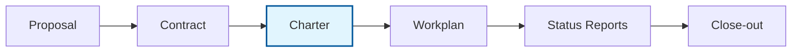

> **Template:** an adaptable copy bundled with the project-starter skill. Replace bracketed placeholders and align it with your own organization's policies before use.

# Project Charter Template

> **CHARTER PURPOSE** — The project charter forms the basis of the relationship between the project team, the Project Sponsor and the working group that has been set up to oversee the implementation of the project and the achievement of its objectives. It also establishes a common understanding between all parties with an interest in the project.

## Where This Fits

The charter bridges the sales process and project execution. It's your first deliverable.

| Document | Purpose | Owner |
|----------|---------|-------|
| **Proposal** | Win the work | Sales/BD |
| **Contract** | Legal terms, payment | Finance |
| **Charter** | Confirm scope, objectives, team | PM |
| **Workplan** | Detailed tasks and timeline | PM |
| **Status Reports** | Track progress, flag issues | PM |
| **Close-out** | Archive, lessons learned | PM |

The proposal and contract may be weeks old by kick-off. The charter is where everyone re-confirms what we're actually doing.

---

## Why Use a Charter?

Many consultants skip this step. That's a mistake.

**It protects the project.** Clients inevitably change scope or delay their own deliverables. When that happens, a signed charter gives you a clear baseline to point to: "Here's what we agreed. Here's what changed. Let's discuss how to adjust." Without it, you're negotiating from memory.

**It's a fresh start.** By the time a project kicks off, the original proposal and contract may already be weeks or months old. Circumstances change. The charter is your chance to confirm that everyone still agrees on objectives, deliverables, and timeline — or to renegotiate before work begins.

**It surfaces risks early.** Discussing risks and assumptions at the start — when everyone is optimistic and collaborative — is far easier than raising them later when things get tense. The charter creates space for that conversation.

**It keeps the team informed.** Not everyone on the project team was part of the proposal process. The charter brings newer consultants up to speed on what we're doing, why, and who's responsible for what.

**It enables fair renegotiation.** When scope changes (and it will), the charter provides a documented basis for adjusting workplan, timelines, deliverables, or budget. Both sides benefit from having this in writing.

---

*When completed, export this page and email to the Project Sponsor (client) for approval. The Charter should be updated as project requirements change, and each revision should be approved by the client in writing via email. Approved Charters supersede the proposal and original statement of work.*

---

## 1. Project Description

| Field | Value |
|-------|-------|
| **Project Name** | *[Full project name]* |
| **Client Organization** | *[Client organization name]* |
| **Client Project Sponsor(s)** | *[Name, title]* |
| **Project Timeline** | *[Start date] to [End date]* |
| **LO Project Owner** | *[Name]* |
| **LO Project Manager** | *[Name]* |
| **Project Code** | *[Project code, e.g., CLIENT-PROJECT-YY]* |
| **Current Version** | Draft |

### Version History

| Version | Date Sent | Changes | Author | Approved By | Approval Date |
|---------|-----------|---------|--------|-------------|---------------|
| 0.01 | | Initial draft | | | |
| 0.02 | | | | | |

---

## 2. Project Summary

*Copy from proposal or Statement of Work.*

### 2.1 Background & Context

*[Describe the business need, current situation, and why this project is needed. What problem does it solve? What opportunity does it address?]*

### 2.2 Overall Purpose

*[State the main purpose of this project in 1-2 sentences.]*

### 2.3 Key Outcomes and Benefits

*[What will be different when this project succeeds? What decisions will be enabled? What improvements will result?]*

---

## 3. Objectives

*List 2-4 objectives with their expected results.*

| Objective | Expected Result |
|-----------|-----------------|
| 1. *[First objective]* | *[How you'll know it's achieved]* |
| 2. *[Second objective]* | *[How you'll know it's achieved]* |
| 3. *[Third objective]* | *[How you'll know it's achieved]* |

---

## 4. Deliverables & Schedule

| Deliverable | Description | Due Date |
|-------------|-------------|----------|
| **Project Charter** | Hold kick-off with team and client working group; finalize charter and workplan | *[Date]* |
| **Data Collection Tools** | *[Describe: interview protocols, surveys, frameworks, etc.]* | *[Date]* |
| **Interim Report** | *[Describe: informal report with emerging findings]* | *[Date]* |
| **Final Report** | *[Describe: format and intended audience]* | *[Date]* |
| **Final Presentation** | *[Describe: online presentation of deliverables]* | *[Date]* |

---

## 5. Assumptions

<strong>Standard Assumptions</strong> (click to expand)

The following are standard assumptions that underlie this Project Charter:

1. **Timely feedback**: The client organization will respond to requests for feedback and relevant information within the scheduled time set in the project plan. Unless agreed otherwise, responses to questions and feedback on draft deliverables will be provided within three working days.

2. **Working group oversight**: A working group will be formed to provide strategic direction and oversight to the project and provide timely approval of deliverables and requests to support or changes to the project plan.

3. **Background documents**: The client organization will provide background documents and, if appropriate, lists of stakeholders for interviewing, within four weeks of project launch unless otherwise stated in the project schedule.

4. **Scope management**: Minor changes to the workplan and deliverables can be made with joint approval of client and LogicalOutcomes throughout the project. Substantive changes or increases must be negotiated, either by replacing elements of the original workplan or by increasing the budget.

5. **Acceptance timeline**: Unless the Project Sponsor requests changes, the final deliverables will be accepted as approved four weeks after their submission.

### Project-Specific Assumptions

*Add any assumptions specific to this project:*

- *[e.g., "The final report must be delivered by [date] because [reason]"]*
- *[Any other constraints everyone needs to acknowledge]*

---

## 6. Risk Assessment

<strong>Standard Risk Framework</strong> (click to expand)

**Rating Guide:**
- **Likelihood**: H (High), M (Medium), L (Low)
- **Impact**: Only list Medium or High impact risks
- If both likelihood and impact are High, you must have a backup plan
- If both are Medium, actively manage throughout the project

### Major Risks — High Likelihood or High Impact

| Risk | Mitigation | Likelihood | Impact |
|------|------------|:----------:|:------:|
| **Client availability**: Staff or working group members unavailable for timely review due to vacations, illness, turnover, or competing deadlines | Identify alternative reviewers at project start | M | H |
| **Task tracking**: Tasks assigned to client staff fall through the cracks and deadlines are missed | Client uses task tracking system; assign escalation point | M | H |
| **Scope creep**: Project scope not clearly managed and goes over budget or time | Negotiate scope changes with commensurate budget adjustment | M | H |
| **Implementation**: Client organization does not implement improvements in response to findings | Define decision-maker requirements upfront; present emerging findings during project | M | H |

### Project-Specific Risks

*Add any risks specific to this project:*

| Risk | Mitigation | Likelihood | Impact |
|------|------------|:----------:|:------:|
| *[Describe risk]* | *[How you'll prevent or respond]* | M | H |

<strong>Standard Managed Risks</strong> (responsibility of LogicalOutcomes)

| Risk | Mitigation | Likelihood | Impact |
|------|------------|:----------:|:------:|
| LO task tracking issues | Use formal task tracking; invite client to escalate concerns | L | H |
| Inadequate stakeholder engagement | Define key stakeholders at start; define minimum engagement level | M | H |
| Methodology gaps | Define methodology at start; include in workplan | L | H |
| Poor quality deliverables | Define approval process at start; include in workplan | L | H |
| Contractor unavailability | Identify backup consulting resources at project start | L | H |
| Confidentiality breach | Define confidential information at start; use appropriate security procedures | L | H |

---

## 7. Workplan

<strong>Standard Workplan Phases</strong> (click to expand)

| Phase | Activities |
|-------|------------|
| **Planning & Initiation** | Engage sponsor and team; define objectives, questions, methodologies; hold kick-off; approve charter |
| **Design & Development** | Define measures and tools; review existing information; test data collection tools |
| **Implementation & Analysis** | Design reports; collect and analyze data; produce interim reports |
| **Communication & Discussion** | Present emerging conclusions; revise based on feedback |
| **Project Closure** | Finalize materials; conduct acceptance review; archive documents; debrief |

### Project Timeline

| Phase | Key Activities | Timeline |
|-------|---------------|----------|
| Planning & Initiation | *[Specific activities]* | *[Dates]* |
| Design & Development | *[Specific activities]* | *[Dates]* |
| Implementation & Analysis | *[Specific activities]* | *[Dates]* |
| Communication & Discussion | *[Specific activities]* | *[Dates]* |
| Project Closure | *[Specific activities]* | *[Dates]* |

---

## 8. Communications Plan

A monthly status report will be distributed by the LogicalOutcomes project manager to the Project Sponsor describing:
- What activities were planned
- What was actually achieved
- The impact of any gap
- Any workarounds necessary to get back on track

*[Add any project-specific communication arrangements]*

---

## 9. Roles & Responsibilities

### Client Team

| Role | Responsibilities | Contact |
|------|------------------|---------|
| **Project Sponsor & Approval Authority** | Provide guidance on objectives and constraints; liaise with senior management; remove roadblocks; approve deliverables and scope changes | *[Name, Email, Phone]* |
| **Client Liaison** | Primary contact person; may take on sponsor responsibilities as delegated | *[Name, Email, Phone]* |

<strong>Full Sponsor Responsibilities</strong> (click to expand)

- Provide guidance regarding overall objectives and constraints of project
- Act as liaison to senior management and manage client expectations
- Communicate with internal and external stakeholders regarding project progress
- Remove roadblocks and respond to risks and problems as identified
- Approve significant changes to scope, timeline, budget, or quality
- Review and approve project documents and deliverables

### LogicalOutcomes Team

| Role                   | Responsibilities                                                                                                            | Contact                      |
| ---------------------- | --------------------------------------------------------------------------------------------------------------------------- | ---------------------------- |
| **Project Owner**      | Project leadership; methodology; author and review deliverables; manage risks and issues                                    | *[Name]*@logicaloutcomes.net |
| **Project Manager**    | Client liaison for operations; monitor scope, quality, schedule, costs, and risks; coordinate implementation; report issues | *[Name]*@logicaloutcomes.net |
| **Researcher/Analyst** | Data collection and analysis; author documents as assigned                                                                  | *[Name]*@logicaloutcomes.net |

<strong>Full Role Descriptions</strong> (click to expand)

**Project Owner:**
- Provide project leadership
- Act as client liaison for methodological and strategic issues
- Define project methodologies
- Author, review, and approve project documents as assigned
- Manage and resolve team-level risks, issues, and changes
- Remove roadblocks to project success
- Review and provide detailed feedback regarding all project documents and deliverables

**Project Manager:**
- Act as client liaison for operational issues
- Monitor project scope, quality, schedule, resources, costs, and risks
- Coordinate implementation of project work
- Ensure project plan, schedule, and budget are up-to-date; detect and manage variances
- Report risks, delays, and problems to Project Owner and Project Sponsor as they arise
- Author, review, and approve project documents as assigned
- Arrange and follow-up on team meetings
- Support Project Owner and Analyst in arranging interviews, reviewing data, and report writing

**Researcher/Analyst:**
- Carry out data collection and analysis as assigned by Project Manager
- Provide leadership and manage work packages as assigned
- Author, review, and approve project documents as assigned

---

## 10. Budget & Payment Schedule

> **Note:** This section may be maintained separately in contract documents or financial tracking systems. Include here only if appropriate for all charter recipients to see.

| Milestone | Amount |
|-----------|--------|
| Approval of Project Charter (25% of total) | $ |
| Delivery of interim report | $ |
| Approval of final report | $ |
| **TOTAL (maximum)** | **$** |

*Invoices will be sent at submission of each deliverable. Payment is due within 30 days of approval.*

*If there is a change to the budget, this line must be revised and approved in a revision of the Project Charter.*

---

## Approval

| | Signature | Date |
|-|-----------|------|
| **Project Sponsor** | | |
| **LO Project Owner** | | |

---

